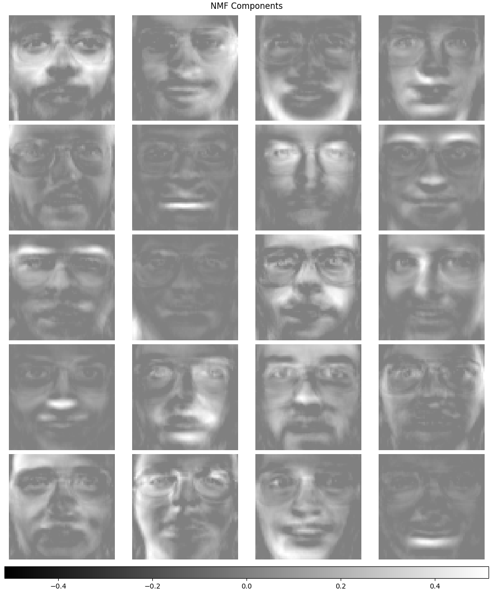
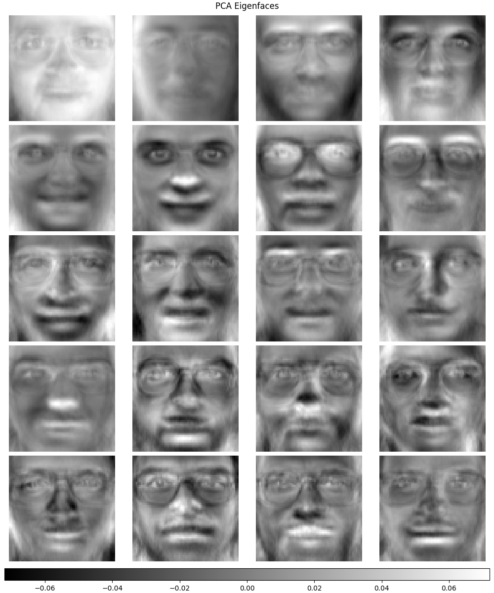

# Non-Negative Matrix Factorization
Gabe Parra, Chad Berghoff

$$
\begin{bmatrix}
1 & 2 \\
2 & 4 \\
3 & 6 \\
4 & 8 \\
5 & 10
\end{bmatrix}

=

\begin{bmatrix}
1 \\
2 \\
3 \\
4 \\
5
\end{bmatrix}

\begin{bmatrix}
1 & 2
\end{bmatrix}
$$

---

<!--
_footer: "Synergies are a confusing topic, take some time to ponder and ask questions."
-->
## Synergies

Synergies describe the basis components necessary to describe the mechanics of a limb as well as it's mechanical constraints during a given task.

---

## Dimensionality Reduction

Dimensionality reduction is the practice of taking something from a high dimensionality to a lower dimensionality. 

**Dimensionality Reduction:**
- Improves interpretability of models and data.
- Identifies information essential to the structure of our data.
- Makes computation more affordable by reducing the size of the problem you are working on.

---

### Dimensionality Reduction Techniques

- Principal Component Analysis (PCA)
- Non-Negative Matrix Factorization (NNF)*
- Factor Analysis
- Manifold Learning
- Autoencoders

**A point of contention**
Although we will focus on NNF, it very well could be that synergies are found from a different dimensionality reduction method or a method that has not been "discovered".

---

## Non-Negative Matrix Factorization

Non-Negative Matrix Factorization is a dimensionality technique that exploits the positivity of non-negative matricies. 

An important feature of NNF is that all of the basis components can only ever be added to, which allows NNF to represent the features of the observed data.

---

<!--
_footer: "Squared $L_2$ Norm (1) and Kullback-Leibler Divergence (2)"
-->
## What is NNF doing?

Non-Negative Matrix Factorization is finding an approximate factorization $WH$ of a given matrix $V$.

The factorization $WH$ is found by using optimization methods on a cost function. Two of which are shown below:

$$
||V - WH||^2 = \sum_{ij}{(V_{ij} - WH_{ij})^2} \tag{1}
$$

$$
D(V||WH) = \sum_{ij}(V_{ij}\log\frac{V_{ij}}{WH_{ij}} - V_{ij} + WH_{ij}) \tag{2}
$$

---

## NNF vs PCA

NMF Basis Components vs PCA Eigenfaces

 

---

## Dimensionality Reduction in HRELab

Dimensionality Reduction has been shown to detect synergies by decomposing EMG signals into "EMG components" that can be used to identify a certain muscle task given a specific patient. 

NNF is the "go to" for analyzing synergies from emg signals. We may be able to find interpratable emg features that can help our research going forward.